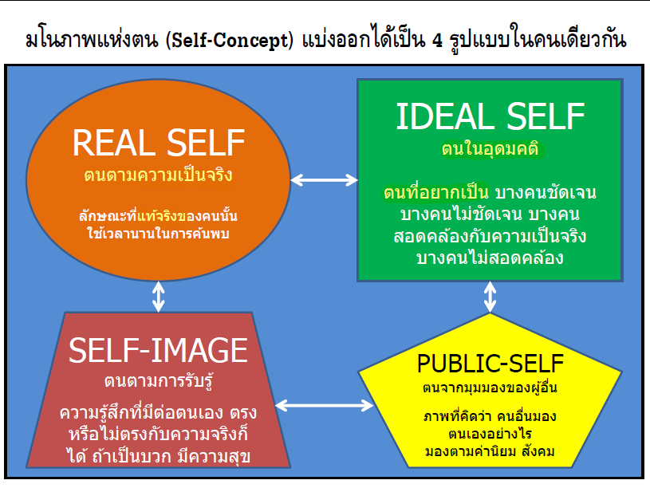

# แนวคิดมนุษยนิยม (Humanistic Approach)

## Genaral Info
- เป็นทฤษฎีที่พยายามอธิบายธรรมชาติของมนุษย์และ ทัศนคติในการมองมนุษย์
โดยเห็นมนุษย์ในแง่ดีงาม มีธรรมชาติใฝ่ดี อยากทาความดี มีความต้องการที่จะพัฒนาตนให้ดียิ่งกว่าปัจจุบัน

- กลุ่มนี้เน้นความสาคัญของประสบการณ์ส่วนตัว (Subjective Experience) 
เน้นว่าบุคคลรับรู้ และ ตีความหมายเหตุการณ์ต่างๆ เรียก “ปรากฏการณ์ของตนเอง” อย่างไร

- คนเราไม่ได้ตกอยู่ภายใต้อิทธิพลของสัญชาตญาณหรือสิ่งเร้าภายนอกตัว

- เป็นกลุ่มมนุษยนิยมเพราะเน้นถึงคุณค่าของมนุษย์ที่มีอิสระในการเลือก (Freedom of Choice)

- หัวข้อที่นักจิตวิทยำกลุ่มนี้สนใจคือ
	- เจตนำรมณ์หรือลิขิตนิยม (Determinism)
	- แรงมุ่งมั่นที่จะเป็นอิสระ (Free will)
	- เสรีภาพ (Freedom)
	- กำรพัฒนาขีดศักยภาพสูงสุดของตนเอง (Self-Actualization)

- คนทุกคนมีเกียรติและศักด์ิศรี คนไม่ใช่วัตถุทำงวิทยำศำสตร์ ดังที่กลุ่มวิทยำศำสตร์คิด

- เน้นถึงคุณค่ำและธรรมชำติท่ดี ีงำมของมนุษย์ (Positive Nature)

- เป้าหมำยของทุกชีวิตคือพัฒนาศักยภาที่ ในตัวตนให้ถึงจุดสูงสุด รู้คุณค่ำแห่งตน มีความรับผิดชอบต่อตนเองและต่อการกระทำ 
ของตนยอมรับผลดีผลเสียจากการเลือกที่จะกระทำ หรือไม่กระทำ ของตน

- กำรพัฒนาความรู้ความสามารถที่ตนเองมีอยู่ให้เต็มที่ (SelfActualization)

## Carl Roger (1902 - 1987)

*The curious paradox is that when I accept myself just as I am, then I can change.*

*“ความขัดแย้งที่น่ำประหลาดก็คือ
เมื่อฉันยอมรับในสิ่งที่ตนเองเป็นแล้ว
ฉันก็สำมำรถเปลี่ยนแปลงตนเองได้ ”*

## **Self : ตัวตน**

- คือ การรวมกันของรูปแบบ ค่านิยม เจตคติ การรับรู้และ
ควำมรู้สึก
- แต่ละบุคคลมีอยู่และเชื่อว่าเป็นลักษณะเฉพาะของเขาเอง
- ตนเอง หมายถึง ฉันและตัวฉัน
- เป็น **ศุนย์กลางที่รวมประสบการณ์ทั้งหมดของแต่ละบุคคล**
- เกิดจารแต่ละบุคคลมี **การเรียนรู้ตั้งแต่วัยเริ่มแรกชีวิต** 
- มีการแรับตัวตามประสบการณืของแต่ละคน
- ภาพลักษณืเรียกว่า **มโนภาพแห่งตน (Self-Concept)** หมายถึง ผมรวมทั้งหมดของลักษณะประจำตัว ค.สามารถ ค่านิยม เจตคติ

## **Self-Concept : มโนภาพแห่งตน**
- หมายถึง เนื้อหาความรู้เกี่ยวกับตนเองที่บุคคล**รับรู้**

- ภาพ 4 ส่วนของมโนภำพแห่งตนจะต้องเป็นสิ่งเดียวกันให้ได้
แต่อย่ำงไรก็ตำมภำพ 4 ส่วนนี้ไม่สามารถทับกันได้สนิทได้ตลอดไป
แต่บำงครั้งจะเป็นภำพที่เข้ามำใกล้และทับกัน ก็จะทำ ให้บุคคลมีความสุข

- หากตน (Self) **ทั้ง 4 ส่วนสอดคล้องกัน (Congruent)** บุคคลนั้นจึงจะมีสุขภาพจิตที่ดี
โดยเฉพาะ **ตนตำมที่เป็นจริง (Real self)** หรือ**ตนตำมกำรรับรู้ (Self-image)**
ควรจะเป็นแบบเดียวกันและควรจะสอดคล้องตนในอุดมคติ (Ideal self)
หรือไม่ควรจะห่ำงไกลเกินควำมจริง

## Self-Awarness : การตระหนักรู้ในตนเอง
- เป็นค.สามารถในการค้นหารู้จักตนเอง ซึ่งจะช่วยเราเวลาเจอกับความเครียดหรือสถานการณ์ต่างๆ
  - รู้ข้อดี/เสียของตนเอง
  - รู้ค.ต้องการและสิ่งที่ไม่ต้องการ

## Self-Acceptance : การยอมรับตนเอง
- การมีความรักและความสุขกับสิ่งที่ตนเองเป็น ยอมรับทั้งส่วนที่ชอบและไม่ชอบโดยไม่มีเงื่อนไข

## Self-Esteem
- ความรู้สึกที่บุคคลมีต่อตนในทางที่ดี
- เคารพและยอมรับตัวเองว่า มีความสำคัญ ความสามารถ
- มีความเชื่อมั่นในตนเอง มีชีวิตอย่างมีเป้าหมาย

### การพัฒนา Self-Esteem
- ดูแลสุขภาพของตน ทั้งร่างกายและจิตใจ
- ใส่ใจเรื่องความปลอดภัย
- ให้เวลาในการทำสิ่งที่ชอบที่มีความสุข
- เรียนรู้ในสิ่งที่สนใจ
- บันทึกค.สุขในแต่ละวัน
- จดสิ่งดีๆของตนวันละอย่าง

### การลด Self-Esteem
- Neagtive Self-talk
- Jealousy and Comparisons
- Hiding Feelings
- Blaming

### ลักษณะของคนที่มี Self-Esteem สูง
- เปิดใจรับคำติและคำชมได้
- มีทัศนคติที่เปิดเผย และมีความกระตือรือร้น
- แสดงออกได้อย่างเหมาะสม
- หน้าตา ท่าทาง และบุคลิกภาพ เต็มไปด้วยความสดใส ร่าเริง
- สามารถพูดถึงความสำเร็จ และ ข้อบกพร่องของตนเองได้
- เป็นผู้ให้และผู้รับได้ ผู้รักและผู้ถูกรักได้

###  การกล้าแสดงออกอย่างเหมาะสม
- การแสดงความคิดเห็นโดยไม่ปิดบังหรืออ้อมค้อม แต่ไม่ก้าวร้าว
- พฤติกรรมการแสดงออก แบ่งเป็น 3 ลักษณะ ได้แก่
  
  1. การแสดงออกอย่างก้าวร้าว (Aggressive Behavior) : ไม่เหมาะสม คุกคามและลดคุณค่าคนอื่น
  2. ไม่กล้าแสดงออก (Passive Behavior) : ไม่กล้าปฎิเสธ ไม่รักษาสิทธิ ลดคุณค่าตนเอง
  3. กล้าแสดงออกอย่างเหมาะสม (Assertive Behavior) : แสดงความคิด ความรู้สึกได้อย่างเหมาะสม โดยไม่คุกคามสิทธิคนอื่น ไม่ก้าวร้าว มีความรู้สึกทางบวกกับตนเอง

### พฤติกรรมกล้าแสดงออกอย่างเหมาะสม
1. รับคำชม
2. แสดงสีหน้าอย่างเหมาะสม
3. แสดงความไม่เห็นด้วยอย่างสุภาพ
4. การขอร้องให้แสดงความกระจ่าง --> สร้างค.เข้าใจ พูดอีกทีได้ไหม
5. การถามเหตุผล
6. พูดเพื่อรักษาสิทธิ
7. แสดงความมั่นคง

## Maslow 
- Maslow เชื่อว่า มนุษย์ทุกคนเกิดมา
พร้อมกับความดีงาม และมีแนวโน้มที่
จะพัฒนาตนเองให้ก้าวหน้าไปสู่ขั้นที่
สมบูรณ์ที่สุด (Self-Actualization)

- ลักษณะของผู็ที่ประสบความสำเร็จที่สมบูรณืแบบ
  1. รับรู้ความเป็นจริง อดทนกับความไม่แน่นอน
  2. ยอมรับตนเองและผู้อื่นความความเป็นจริง
  3. มีความคิดและพฤติกรรมของตนเองไม่ขึ้นผู้อื่น
  4. ยึดตัวปัญหาเมื่อจะต้องแก้ไข ไม่ใช่ตนเอง
  5. มีอารมณ์ขัน
  6. มีความคิดริเริ่มสร้างสรรค์
  7. มีน้าใจ มีธรรมประจาใจ
  8. มีความสนใจที่จะช่วยเหลือเพื่อนมนุษย์
  9. รู้สึกถึงคุณค่าของประสบการณ์ชีวิต
  10. สร้างความสนิทสนมได้อย่างลึกซึ้ง
  11. มองชีวิตอย่างมีจุดหมายปลายทอง

# แนวคิดเชิงรู้คิด (Cognitive Approach)

-  กระบวนการทางจิตของมนุษย์มีความซับซ้อนยิ่ง
กว่าพฤติกรรมที่สังเกตเห็นได้ชัดเจนหรือมีแต่
ด้ำนที่สามารถสัมผัสได้โดยง่าย เช่น มีเรื่องของ
ความคิด ความรู้สึก ความคาดหวัง เป็นต้น

- ง่าย และ คับแคบเกินไปที่จะอธิบายพฤติกรรม
มนุษย์โดยจำกัดเฉพาะสิ่งเร้าและการ
ตอบสนอง

- การทำงานของจิตและระบบประสาทของมนุษย์ มีความซับซ้อนและสัมพันธ์กัน หลายลำดับขั้น
- มนุษย์อยู่ท่ำมกลำงสิ่งแวดล้อมด้ำนข้อมูลข่ำวสำร
ขณะใดท่บี ุคคล “รับรู้” ข้อมูลข่ำวสำร เขำจะ
จัดกำรกับข้อมูลข่ำวสำรนั้น
- แนวคิดกลุ่มพฤติกรรมสำมำรถใช้อธิบำยได้เฉพำะ
พฤติกรรมง่ำยๆของมนุษย์เนื่องจำกละเลย
องค์ประกอบเกี่ยวกับระบบกำรทำ งำนที่สำ คัญของ
มนุษย์ไป นั่นคือ กระบวนกำรรู้กำรคิด (Cognitive
process)

- จิตวิทยำรู้คิด หมำยถึง กำรศึกษำกระบวนกำรทำง
จิตด้วยระเบียบวิธีทำงวิทยำศำสตร์ แนวคิดนี้คือ
กำรทำกำรทดลองและกำรสรำ้ งองคค์ วำมรูใ้ หม่ๆ
ด้วยระเบียบวิธีทำงวิทยำศำสตร์ เพื่ออธิบำยกำร
ทำงำนของกระบวนกำรทำงจิต

# แนวคิดเชิงประสาทและชีวภาพ (Neurobiological Approach)

• แนวคิดนี้มีหลักกำรว่ำ กระบวนกำรทำงจิตทุกประเภทของ
มนุษย์ มีศูนย์บัญชำกำรอยู่ที่สมองและระบบประสำท

• กำรศึกษำพฤติกรรมของบุคคล ต้องศึกษำกำรทำ งำนของสมอง
และระบบประสำท รวมทั้งสภำวกำรณ์กำรทำงำนทำงชีวภำพ
ของบุคคลซึ่งเชื่อมโยงกับสมองและระบบประสำท

• เช่น พฤติกรรมกำรเรียนรู้ เขำจะให้ควำมสนใจว่ำในขณะที่มี
กำรเรียนรู้เกิดขึ้น สมองและระบบประสำททำ งำนอย่ำงไร

# ความสำคัญ
- ทำให้คนใช้ชีวิตอย่างเต็มศักยภาพ
- การนำหลายแนวคิดไปใช้ --> เข้าใจตนเอง เข้าใจผู้อื่น อยู่ในสังคมอย่างมีความสุข